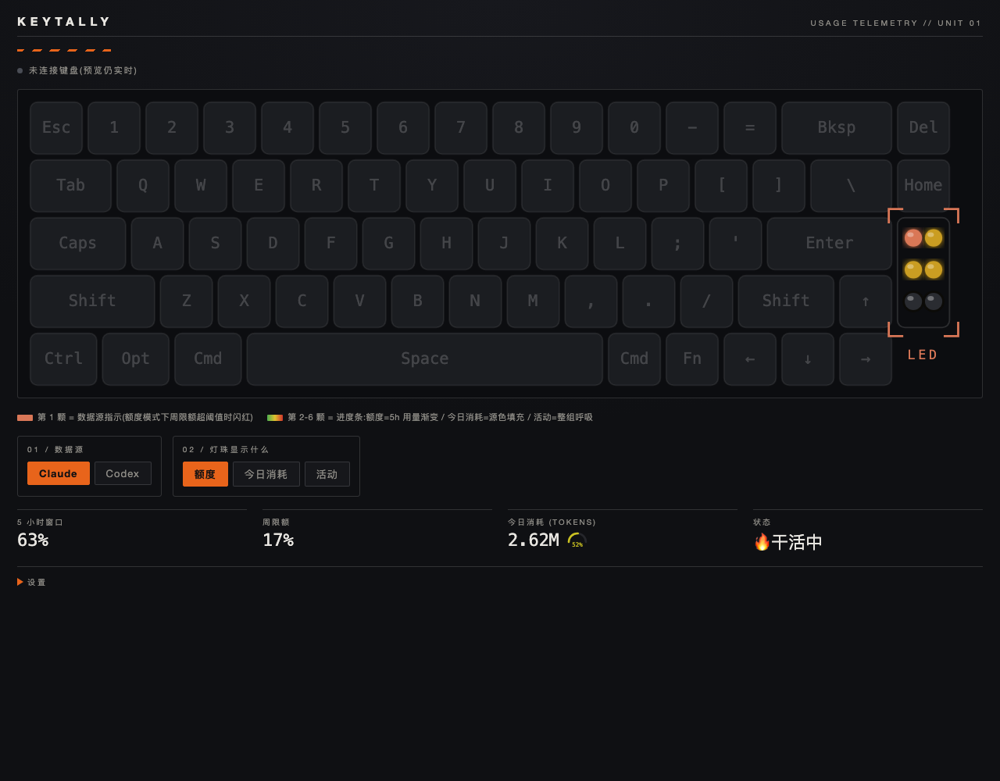

<div align="center">

# ⌨️ KeyTally

**给你的 AI 装一盏 tally light——额度、消耗、工作状态,全在键盘灯上。**

Claude Code / Codex 的额度、今日消耗、实时活动,直接显示在任何 VIA/QMK 键盘的灯上。macOS 菜单栏常驻,NASApunk 风格界面。

[English](README.md) · [固件适配指南](firmware/README.md) · [HID 协议](docs/protocol.md)



</div>

## 三种模式

- 🟢→🔴 **额度**:订阅套餐 5 小时窗口 / 周限额,绿到红渐变
- 📊 **今日消耗**:今天烧掉的 token 相对日预算的进度
- 🫁 **活动**:AI 干活时灯呼吸,空闲时恢复你自己的灯效
- 🔀 一个按键(或点击)在 Claude / Codex 之间切换

## 两档体验,插上自动识别

| | 🌍 通用模式 | 🚀 Pro 模式 |
|---|---|---|
| 适用 | **任何带灯的 VIA 键盘**,零刷机即插即用 | 有社区固件的板子(适配约 5 分钟) |
| 灯效 | 整板颜色映射用量 | 逐灯:进度条 + 数据源指示灯 |
| 键盘按键切换 | — | ✅ 可绑定,双向同步 |
| app 退出 | 重启键盘即还原 | 固件 60 秒自动恢复原灯效 |
| 灯位自定义 | — | **在 app 里点选/框选灯珠分配职责** |

安全性:通用模式所有写入不落 EEPROM,拔插即还原;Pro 刷机自动备份并写回 VIA 键位与宏,并尝试读出原厂固件供一键还原。

## 安装

```sh
# 依赖:Rust(rustup.rs)+ Node 20+
git clone https://github.com/siwei-yuan/keytally
cd keytally/app
npm install
npm run tauri build    # 开发调试用 npm run tauri dev
```

- Pro 固件构建需要 QMK 工具链:`brew install qmk/qmk/qmk`,然后 `./firmware/build.sh`
- 事件级精准活动检测(可选):Claude Code hooks + Codex notify,见 [hooks/](hooks/)

## 使用

1. 有线 USB 插入键盘(Raw HID 不走蓝牙)
2. app 自动探测并显示档位;选数据源和显示指标
3. 设置里配日预算、告警阈值、双源颜色
4. Pro 模式下,在键盘预览里点选或框选灯珠,给它们分配「进度条 / 源指示 / 不参与」

## 许可

`app/`、`collector/`、`hooks/`、`docs/` 为 MIT;`firmware/` 因派生自 QMK 为 GPL-2.0。
